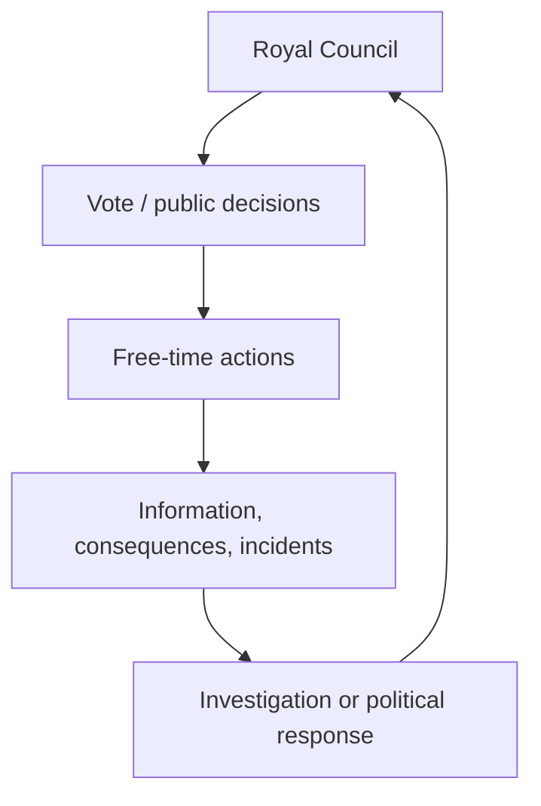

# Gameplay Loop

Each game day lasts roughly **20 minutes** and alternates between a political meeting and free action.

## Royal Council

The council creates public commitments and social information. Players may vote on taxes, trade, military deployment, pardons, imprisonment, or execution.

## Free time

Players explore, negotiate, gain resources, court factions, investigate, recruit help, or plan illegal actions. Important activities include meeting NPCs, buying favors, gathering evidence, forming alliances, and planning sabotage.

## Resolution

Actions change the [[Power Economy]], generate evidence or rumors, and alter [[Relationships]]. Death or scandal pivots the next council toward investigation and crisis.

